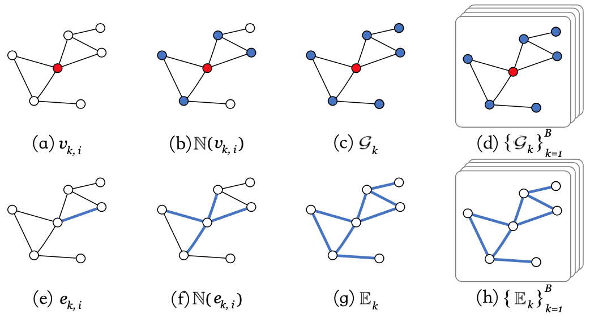
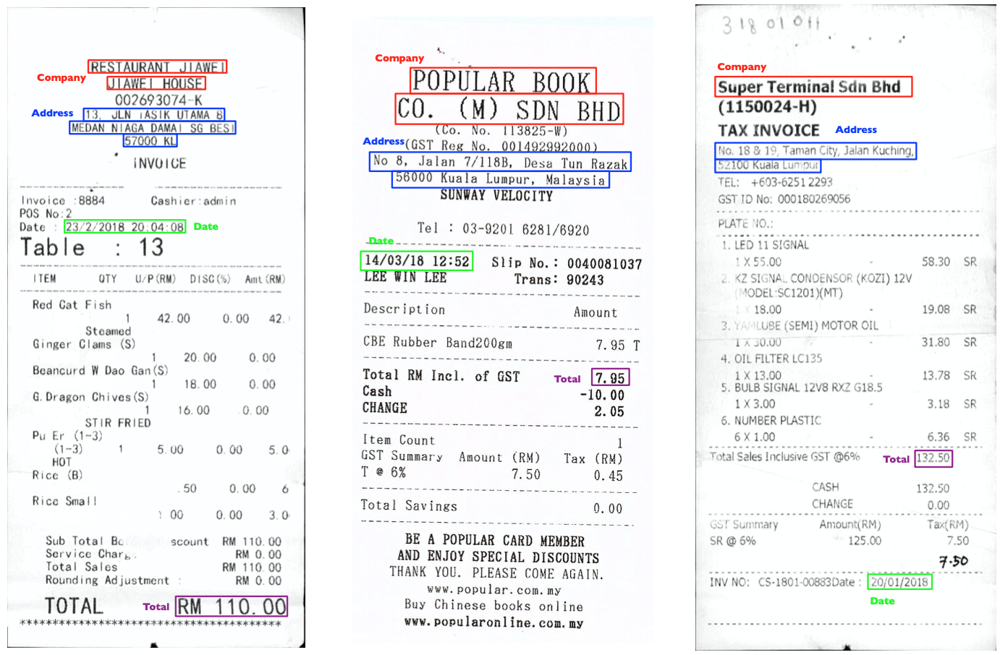

# Graph Normalization

**Learning Graph Normalization for Graph Neural Networks** [ArXiv](https://arxiv.org/abs/2009.11746.pdf)

**note1**: Our implementation is based on [graphdeeplearning/benchmarking-gnns](https://github.com/graphdeeplearning/benchmarking-gnns), thanks for their great work! 

**note2**: For some business reasons, the released code may be a little different from our original code. If you find any problem, feel free to contact us.



## Updates

**Sep 28, 2020**

- add Softmax United Norm

**Sep 24, 2020**

- First release of the project.

## 1. Benchmark initialization

[Follow these instructions](https://github.com/cyh1112/GraphNormalization/blob/master/docs/01_benchmark_installation.md) to install the benchmark and setup the environment.

[Proceed as follows](https://github.com/cyh1112/GraphNormalization/blob/master/docs/02_download_datasets.md) to download the benchmark datasets.

[Use this page](https://github.com/cyh1112/GraphNormalization/blob/master/docs/03_run_codes.md) to run the codes and reproduce the published results.

## 2. Graph Normalization

Node-wise Normalization: equivalent to [Layer Normalization](https://arxiv.org/pdf/1607.06450.pdf)

Adjance-wise Normalization: [adjance_norm.py](https://github.com/cyh1112/GraphNormalization/blob/master/norm/adjance_norm.py)

Graph-wise Normalization: [graph_norm.py](https://github.com/cyh1112/GraphNormalization/blob/master/norm/graph_norm.py)

Batch-wise normalization: equivalent to [Batch Normalization](https://arxiv.org/pdf/1502.03167.pdf)

United Normalization:  [united_norm.py](https://github.com/cyh1112/GraphNormalization/blob/master/norm/united_norm_common.py)

## 3. Usage

Modify the value of  `norm` in `config.json` or add one kind of norm after `--norm`. 

Run the following command：

```shell
python main_SBMs_node_classification.py --dataset CLUSTER --gpu_id 3 --seed 41 --config 
'configs/SBMs_node_clustering_GatedGCN_CLUSTER_100k.json' --norm GraphNorm
```

The choices of `norm` consist of "NodeNorm", "AdjanceNorm", "GraphNorm", "BatchNorm", "UnitedNorm","UnitedNormSoftmax"

## 4. SROIE

#### Introduction

For a receipt, each text bbox can be viewed as a node of a graph. Its positions, the attributes of bounding box, and the corresponding text are used as the node feature. Our goal is to label each node (text bounding box) with five different classes, including Company, Date, Address, Total and Other. Sample images are shown below:



#### Dataset

SROIE Dataset Download: [Dropbox](https://www.dropbox.com/s/v1aywni6ch135nb/sroie.tar.gz?dl=0), [BaiduPan: u4tm](https://pan.baidu.com/s/1owQJsZ1EjKqk3D65sX6SQg)

#### Train

```shell
cd sroie
python train.py
```

#### Experiment

| Text Field | No Norm | Node-wise | Adjance-wise | Graph-wise | Batch-wise | United Norm |
| :--------: | :-----: | :-------: | :----------: | :--------: | :--------: | ----------- |
|   Total    |  87.5   |   91.9    |     74.5     |    96.8    |    94.8    | 94.5        |
|    Date    |  96.5   |   98.0    |     95.9     |    98.8    |    97.4    | 97.4        |
|  Address   |  91.6   |   92.0    |     80.0     |    94.5    |    93.9    | 93.6        |
|  Company   |  92.2   |   93.3    |     87.8     |    94.5    |    93.0    | 94.8        |
|  Average   |  92.0   |   94.0    |     84.6     |    96.2    |    94.8    | 95.1        |

## 5. Reference

```
@misc{chen2020learning,
    title={Learning Graph Normalization for Graph Neural Networks},
    author={Yihao Chen and Xin Tang and Xianbiao Qi and Chun-Guang Li and Rong Xiao},
    year={2020},
    eprint={2009.11746},
    archivePrefix={arXiv},
    primaryClass={cs.LG}
}
```

### License

This project is licensed under the MIT License. See LICENSE for more details.

